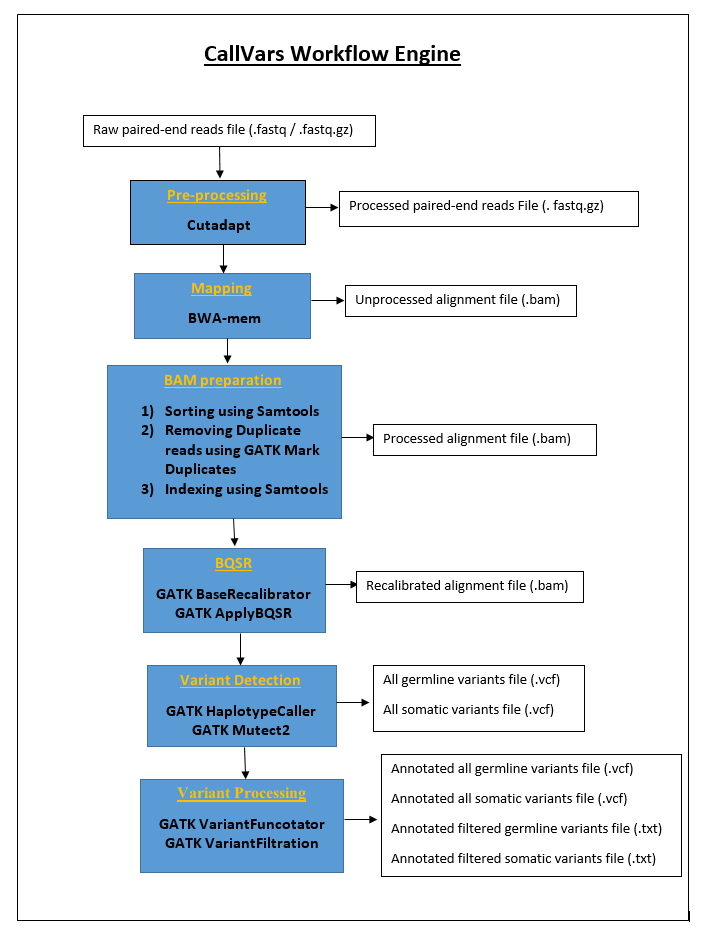

# <ins>CallVars:</ins> 

**CallVars is an automated, reproducible and scalable Snakemake workflow that takes paired-end FastQ files directly to a filtered list of high confidence variants for clinical review. This workflow largely follows [Broad Institute's Best Practices](https://software.broadinstitute.org/gatk/best-practices/workflow?id=11145) guidelines for germline short variant discovery (SNPs + Indels) for single sample and also reports a filtered list of somatic variants.** 

**CallVars is configured to run with parameters listed in "config.yaml" file, which is attached in this repository. You may change parameter values in config file to customize the workflow to your needs. You can list your samples (within "SAMPLE" section) in config file to scale the workflow. You can also choose to run the workflow either with hg19 or hg38 version of human reference genome. The description below is pertaining to hg19.**

CallVars can be helpful to anyone working with targeted gene panels or even whole exomes to detect disease causing/associated variants that can potentially help clinicians with a diagnosis/treatment. If you think CallVars can help with your study, feel free to DM me on twitter [(@IAnalyzeGenomes)](https://twitter.com/IAnalyzeGenomes) with any questions. Feedback/comments/bug reports/contributions are welcome for its improvement.

## <ins>Benchmarking:</ins> 
CallVars reported a 100% sensitivity for SNPs and 98.5% sensitivity for SNPs+Indels in four Genome In A Bottle (GIAB) samples [NA12878, NA24385, NA24143 and NA24149] combined, for a targeted panel of 64 cancer specific genes as listed below. VCFEVAL utility from Real Time Genomics was used to evaluate the sensitivity.
		
	ALK, APC, ATM, AXIN2, BAP1, BARD1, BMPR1A, BRCA1, BRCA2, BRIP1, CDC73, CDH1, CDK4, CDKN1C, CDKN2A, CHEK2,
	DICER1, EPCAM, FANCC, FH, FLCN, GPC3, GREM1, HOXB13, MAX, MEN1, MET, MITF, MLH1, MSH2, MSH6, MUTYH, NBN, 
	NF1, NF2, PALB2, PHOX2B, PMS1, PMS2, POLD1, POLE, PRKAR1A, PTCH1, PTEN, RAD51C, RAD51D, RB1, RET, SDHA, 
	SDHAF2, SDHB, SDHC, SDHD, SMAD4, SPRED1, STK11, SUFU, TMEM127, TP53, TSC1, TSC2, VHL, WT1 and XRCC2

## <ins>Setting up a CallVars working directory:</ins>
All the below listed files/folders must be present in the working directory before you run CallVars. Make sure the names of files/folders match exctly as listed.  

	- "FastQ" folder containing paired-end reads ending in _R1.fastq and _R2.fastq (test files A_R1.fastq and A_R2.fastq attached in repo)
	- "CallVars.yml" (Attached in repo, this file is needed while creating a conda environment for running CallVars.)
	- "Snakefile" (Attached in repo. This file is needed while running CallVars.)
	- "config.yaml" (Attached in repo, this file lists samples and parameter values. You may adjust these per your need.)
	- "Target.bed" (Attached in repo. This file can be replaced by your target file of interest in BED format)
	- "gatkPythonPackageArchive.zip" (Attached in repo, this file is needed while creating a conda environment for running CallVars.)
	

You will need to download each of the below listed files from their respective public repositories. I have provided links to these resources.

	- "1000G_phase1.indels.hg19.sites.vcf"
	- "1000G_phase1.indels.hg19.sites.vcf.idx"
	- "Mills_and_1000G_gold_standard.indels.hg19.sites.vcf"
	- "Mills_and_1000G_gold_standard.indels.hg19.sites.vcf.idx"
	These 1000 genome indel files can be downloaded using below link.
	ftp://gsapubftp-anonymous@ftp.broadinstitute.org/bundle/hg19/
	
	- "dbSNP_20180423.vcf"
	- "dbSNP_20180423.vcf.idx"
	These dbSNP files can be downloaded usibg below link.
	ftp://ftp.ncbi.nih.gov/snp/organisms/human_9606_b151_GRCh37p13/VCF/
	
	- "GNOMAD_hg19.vcf"
	- "GNOMAD_hg19.vcf.idx"
	These gnomAD files can be downloaded using below link.
	http://hgdownload.cse.ucsc.edu/gbdb/hg19/gnomAD/vcf/
	
	- HG19 Reference Genome Folder ‘UCSCWholeGenomeFasta’ containing files
  	"genome.dict"
	"genome.fa"
	"genome.fa.amb" 
	"genome.fa.ann"
	"genome.fa.bwt"
	"genome.fa.fai"
	"genome.fa.pac"
	"genome.fa.sa"
	"GenomeSize.xml"
	The reference genome files can be downloaded in 2bit format using below link.
	http://hgdownload.cse.ucsc.edu/gbdb/hg19/
	The utility program, twoBitToFa (available from the kent src tree), can be used to extract .fa file(s) from this file.  
	A pre-compiled version of the command line tool can be found at: http://hgdownload.cse.ucsc.edu/admin/exe/linux.x86_64/
	Converting 2bit to fa --> ./twoBitToFa hg19.2bit hg19.fa
	renaming --> mv hg19.fa genome.fa
	indexing .fa file --> bwa index genome.fa
	Creating .dict file --> gatk CreateSequenceDictionary –R genome.fa

	
	- dataSourcesFolder containing below data source. 
	Genecode, Clinvar, Gnomad
	Data source was downloaded using below link.
	https://console.cloud.google.com/storage/browser/broad-public-datasets/funcotator --> funcotator_dataSources.v1.6.20190124g.tar.gz

## <ins>Installing and Running CallVars on Linux CLI:</ins> 
#### 1)	Check the working directory and FastQ files: 

In the linux terminal, change the directory to the working directory that contains all the needed files and folders for running snakemake.
Make sure your fastq files are in a ‘FastQ’ directory and they end in ‘_R1.fastq’ and ‘_R2.fastq’, say A_R1.fastq and A_R2.fastq. The pipeline also works with gzipped fastq files, say A_R1.fastq.gz and A_R2.fastq.gz.

#### 2)	Install miniconda: 

Use below link to install miniconda.

https://conda.io/projects/conda/en/latest/user-guide/install/linux.html

#### 3)	Install snakemake using conda:
	
		conda install -c bioconda -c conda-forge snakemake

#### 4)	Create environment CallVars using conda:
	
		conda env create –n CallVars –f CallVars.yml

#### 5)	Activate CallVars environment using conda:

		conda activate CallVars

#### 6)	Running CallVars: 
Ensure you run the below command's in the working directory.

Use below command on CLI for a dry run:
		
		snakemake -np

		
Use below command on CLI to execute the workflow:
		
		snakemake
		
Use below command on CLI if your machine supports multiple CPU cores:
		
		snakemake --cores N

After the worklow has run successfully, below listed files will be available for clinical review. If you are running more samples then you will see these files for all your samples.

	1] CallVars/Reports/A_Germline.txt containing a filtered list of germline variants.
	2] CallVars/Reports/A_Somatic.txt containing a filtered list of somatic variants.
	3] CallVars/Reports/A_Germline_All.vcf containing a full list of germline variants.
	4] CallVars/Reports/A_Somatic_All.vcf containing a full list of somatic variants.
	5] CallVars/BQSR/A_PerBaseCov.txt containing coverage for each base.
	6] CallVars/BQSR/A_PerBaseCov_LessThan20.txt containing bases for which coverage is less than 20.
	7] CallVars/Reports/A_samtools.vcf containing a full list variants from samtools mpileup.

CallVars sequentially performs below steps of Next-Gen Sequencing (NGS) analysis.

# <ins>CallVars Workflow:</ins>

## 1) Pre-processing using Cutadapt

Pre-processing prepares the data for NGS analysis. When DNA or RNA molecules are sequenced using Illumina short reads technology, the machine may sequence into the adapter ligated to the 3’ end of each molecule during library preparation. Consequently, the reads that are output contain the sequence of the molecule of interest and also the adapter sequence. Also, with Illumina sequencing machines, the quality of reads is high at the beginning but degrades towards the 3’ end of the reads. 
	
CallVars uses Cutadapt to remove adapters from sequencing reads. Cutadapt also trims the read ends with quality below 20 and removes the ambiguous bases (N’s) from the reads ends. 

The adapters to be trimmed and threshold for quality values can be customized using the config.yaml file attached in this repository. 

## 2) Mapping using BWA
	
Once the high quality reads are obtained from pre-processing, the next step is mapping them to human reference genome. CallVars uses BWA-mem to map short Illumina paired-end reads to hg19/hg38 version of human reference genome. The reference genome to be used can be configured using the config.yaml file attached in the repo. 

This step generate a Binary Alignment Map also called a BAM file. The reference genome files needed for the analysis were downloaded in 2bit format using below link.
	
http://hgdownload.cse.ucsc.edu/gbdb/hg19/

## 3) Sorting using samtools
	
Now that we have a BAM file, we need to index it. All BAM files need an index, as they tend to be large and the index allows us to perform computationally complex operations on these files without it taking days to complete. Before we index the BAM file we need to sort them by position and remove duplicates. This step performs sorting the BAM file by position.
	
## 4) Removing duplicates using GATK MarkDuplicates
	
CallVars uses this tool to locate and remove duplicate reads in a BAM file, where duplicate reads are defined as originating from a single fragment of DNA. Duplicates can arise during sample preparation e.g. library construction using PCR. The MarkDuplicates tool works by comparing sequences in the 5 prime positions of read-pairs in a BAM file.
	
## 5) Indexing using samtools
	
CallVars now perform indexing discussed in step 3 using samtools. 
	
## 6) Base quality score recalibration using GATK BaseRecalibrator and ApplyBQSR
	
CallVars uses GATK BaseRecalibrator and ApplyBQSR to perform Base Quality Score Recalibration (BQSR). Every base sequenced by machine is assigned a base quality score. These scores play an important role in variant detection. Unfortunately, the scores produced by the machines are subject to various sources of systematic (non-random) technical error. Some of these errors are due to the physics or the chemistry of how the sequencing reaction works, and some are probably due to manufacturing flaws in the equipment.

BQSR uses a machine learning approach to model and correct systematic base scoring errors in particular regions of the genome such as homopolymer runs. It works in a two-pass manner, first building a model over all bases in the dataset as well as a set of known variants and writing the model to a recalibration table, as performed by GATK BaseRecalibrator. The second pass actually applies the learned model to correct per-base alignment quality scores to output a recalibrated BAM, as performed by GATK AppyBQSR. 
	

## 7) Germline variant detection using GATK HaplotypeCaller

CallVars uses GATK HaplotypeCaller to call germline SNPs and indels via local de-novo assembly of haplotypes in an active region. In other words, whenever the program encounters a region showing signs of variation, it discards the existing mapping information and completely reassembles the reads in that region. This allows the HaplotypeCaller to be more accurate when calling regions that are traditionally difficult to call, for example when they contain different types of variants close to each other. It also makes the HaplotypeCaller much better at calling indels than position-based callers like UnifiedGenotyper.

## 8) Somatic variant detection using GATK Mutect2
	
CallVars uses GATK Mutect2 to call somatic short mutations via local assembly of haplotypes. Short mutations include single nucleotide (SNPs) and insertion and deletion (indels) alterations. The caller uses a Bayesian somatic genotyping model and uses the assembly-based machinery of HaplotypeCaller. 

## 9) Functional annotation for germline variants using GATK Funcotator
	
CallVars uses GATK Funcotator (FUNCtional annOTATOR) to analyze given variants for their function (as retrieved from a set of data sources) and produces the analysis in a specified output file. This tool is a functional annotation tool that allows a user to add annotations to called variants based on a set of data sources, each with its own matching criteria.
	
Data from Genecode, Clinvar and Gnomad were used for annotation of variants. Data source was downloaded using below link.
	
https://console.cloud.google.com/storage/browser/broad-public-datasets/funcotator --> funcotator_dataSources.v1.6.20190124g.tar.gz
	
## 10) Functional annotation for somatic variants using GATK Funcotator
	
This step performs functional annotation as discussed in step 9 for somatic variants.

## 11) Variant filtration for germline variants using GATK VariantFiltration
	
[GATK guidelines](https://software.broadinstitute.org/gatk/documentation/article.php?id=6925) were used to apply generic hard-filtering to add PASS/FAIL tags to variants. Note that CallVars doesn't filter the variants based on PASS/FAIL tags. 
CallVars currently uses gnomAD allele frequency as a key filter to report variants having either genomes or exomes allele frequency less than 1% for clinical review. This value can be customized using the config.yaml file attached in this repository. 
	
## 12) Variant filtration for somatic variants using GATK VariantFiltration 
	
This step performs filtering as discussed in step 11 for Somatic variants.

# <ins>Author:</ins>
[Amit Rupani](https://twitter.com/IAnalyzeGenomes) 

If you think CallVars can help with your study, feel free to DM me on twitter [@IAnalyzeGenomes](https://twitter.com/IAnalyzeGenomes) with any questions. Feedback/comments/bug reports/contributions are welcome for its improvement.
